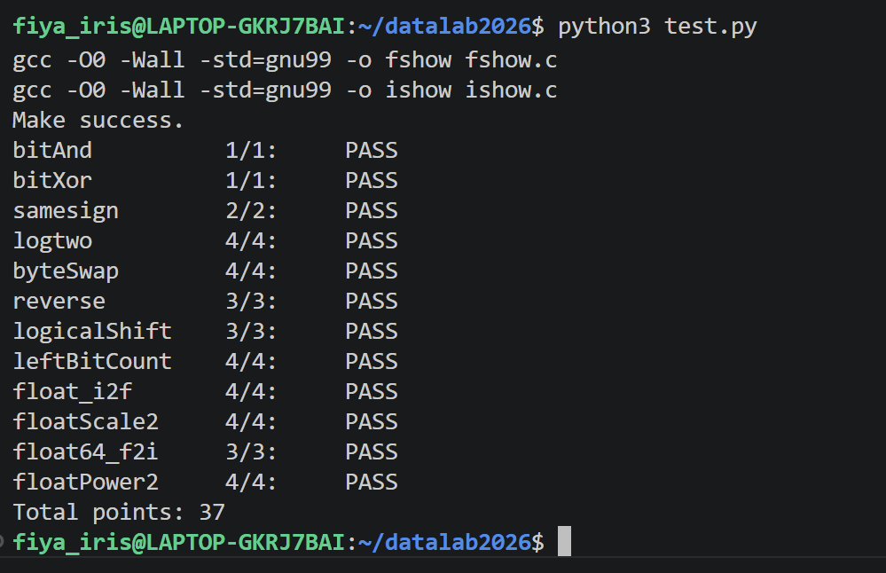

# datalab 报告

姓名：李非霏

学号：2025201698

| 总分 | bitAnd | bitXor | samesign | logtwo | byteSwap | reverse |
| --- | --- | --- | --- | --- | --- | --- |
| 37 | 1 | 1 | 2 | 4 | 4 | 3 |

| logicalShift | leftBitCount | float_i2f | floatScale2 | float64_f2i | floatPower2 |
| --- | --- | --- | --- | --- | --- |
| 3 | 4 | 4 | 4 | 3 | 4 |

test 截图：


<!-- TODO: 用一个通过的截图，本地图片，放到 imgs 文件夹下，不要用这个 github，pandoc 解析可能有问题 -->

## 解题报告

### 亮点

1. byteSwap
2. logtwo
3. float_i2f

### bitAnd

```c
int bitAnd(int x, int y) {
    return ~(~x | ~y);
}
```

这题比较简单，主要是题目不让直接用 `&`。我用了德摩根律，把 `x & y` 改写成 `~(~x | ~y)`，这样就只用了题目允许的 `~` 和 `|`。

### bitXor

```c
int bitXor(int x, int y) {
    return ~(x & y) & ~(~x & ~y);
}
```

这题不能直接使用 `^`。我的想法是异或只有在两个 bit 不一样的时候才是 1，所以把“两个都是 1”和“两个都是 0”这两种情况排除掉，剩下的就是异或结果。

### samesign

```c
int samesign(int x, int y) {
    if (!x)
        return !y;

    if (!y)
        return 0;

    return !((x ^ y) >> 31);
}
```

这题主要是看两个数的符号位是不是一样。如果两个数异号，`x ^ y` 的最高位就会是 1；如果同号，最高位就是 0。

不过题目里 0 比较特殊，因为 0 既不是正数也不是负数，所以我先把和 0 有关的情况单独处理，再判断符号位。

### logtwo

```c
int logtwo(int v) {
    int a, b, c, d, e;
    int mask16 = (0xFF << 8) | 0xFF;

    a = v > mask16;
    v = v >> (a << 4);

    b = v > 0xFF;
    v = v >> (b << 3);

    c = v > 0xF;
    v = v >> (c << 2);

    d = v > 0x3;
    v = v >> (d << 1);

    e = v > 0x1;

    return (a << 4) |
           (b << 3) |
           (c << 2) |
           (d << 1) |
           e;
}
```

这题其实就是找最高位的 1 在第几位，因为对于正整数来说，这个位置就是 `log2` 的整数结果。

我没有从最低位开始一位一位找，而是按照 16、8、4、2、1 这样一步一步缩小范围，有点像二分查找。这样可以更快地找到最高有效位。

### byteSwap

```c
int byteSwap(int x, int n, int m) {
    int ns = n << 3;
    int ms = m << 3;

    int nb = (x >> ns) & 0xFF;
    int mb = (x >> ms) & 0xFF;

    int diff = nb ^ mb;

    return x ^ ((diff << ns) | (diff << ms));
}
```

这题我觉得比较巧。因为一个 byte 是 8 bit，所以用 `n << 3` 和 `m << 3` 就可以找到两个字节开始的位置。

先把两个字节取出来，然后算它们的异或值 `diff`。再把 `diff` 异或回原来的两个位置，就可以直接把两个字节交换，不需要先把原来的字节清零再重新放回去。

### reverse

```c
unsigned reverse(unsigned v) {
    unsigned result = 0;
    int i = 32;

    while (i) {
        result = (result << 1) | (v & 1);
        v = v >> 1;
        i = i - 1;
    }

    return result;
}
```

这题允许使用循环，所以我用了比较直接的方法。

每次先用 `v & 1` 取出原数最低位，然后把 `result` 左移一位，再把这一位放进去。接着让 `v` 右移，重复 32 次之后，原来的 bit 顺序就完全反过来了。

### logicalShift

```c
int logicalShift(int x, int n) {
    int mask;

    mask = ~(((1 << 31) >> n) << 1);

    return (x >> n) & mask;
}
```

这题的问题是，有符号整数右移的时候，如果是负数，左边可能会补 1，但是逻辑右移要求左边补 0。

所以我的方法是先正常右移，再构造一个 mask，把高位补出来的 1 清掉。最后用 `&` 保留真正需要的低位，就得到了逻辑右移的结果。

### leftBitCount

```c
int leftBitCount(int x) {
    int y = ~x;
    int count = 0;
    int t;

    t = !(y >> 16) << 4;
    count = count + t;
    y = y << t;

    t = !(y >> 24) << 3;
    count = count + t;
    y = y << t;

    t = !(y >> 28) << 2;
    count = count + t;
    y = y << t;

    t = !(y >> 30) << 1;
    count = count + t;
    y = y << t;

    t = !(y >> 31);
    count = count + t;
    y = y << t;

    count = count + !y;

    return count;
}
```

这题要统计最左边连续有多少个 1，直接数不太方便。

我先对 `x` 取反，这样原来开头连续的 1 就变成了连续的 0。然后再按 16、8、4、2、1 这样分段判断前面有多少个 0，思路和 `logtwo` 有点像，也是用二分的方法减少判断次数。

### float_i2f

```c
unsigned float_i2f(int x) {
    unsigned ux = x;
    unsigned sign;
    unsigned exp;
    unsigned frac;
    unsigned sig;
    unsigned rem;
    unsigned half;
    int e = 31;
    int shift;

    if (x == 0)
        return 0;

    sign = ux & 0x80000000;

    if (sign)
        ux = -ux;

    while (!(ux >> e))
        e = e - 1;

    exp = e + 127;

    if (e <= 23) {
        frac = (ux << (23 - e)) & 0x7FFFFF;
    }
    else {
        shift = e - 23;

        sig = ux >> shift;
        rem = ux & ((1 << shift) - 1);
        half = 1 << (shift - 1);

        if (rem > half)
            sig = sig + 1;
        else if (rem == half) {
            if (sig & 1)
                sig = sig + 1;
        }

        if (sig >> 24) {
            exp = exp + 1;
            sig = sig >> 1;
        }

        frac = sig & 0x7FFFFF;
    }

    return sign | (exp << 23) | frac;
}
```

这题是我觉得最难的一题，因为需要自己把一个整数转成 IEEE 754 单精度浮点数的二进制形式。

我先处理符号位，然后把整数变成绝对值，再找到最高有效位来确定指数。指数还需要加上单精度浮点数的偏置 127。

如果有效数字可以直接放进 fraction，就直接移动到对应的位置；如果位数太多放不下，就需要把低位舍掉。这里还要按照 round-to-nearest-even 的规则处理舍入，所以这题比前面的位运算题复杂很多。

### floatScale2

```c
unsigned floatScale2(unsigned uf) {
    unsigned sign = uf & 0x80000000;
    unsigned exp = uf & 0x7F800000;
    unsigned frac = uf & 0x007FFFFF;

    if (exp == 0x7F800000)
        return uf;

    if (exp == 0)
        return sign | (frac << 1);

    exp = exp + 0x00800000;

    if (exp == 0x7F800000)
        return sign | exp;

    return sign | exp | frac;
}
```

这题我先把浮点数拆成符号位、指数和 fraction，然后根据指数分情况处理。

如果指数全是 1，说明是 NaN 或无穷大，直接返回原值。指数是 0 的时候属于 0 或非规格化数，这时把 fraction 左移一位就相当于乘 2。

如果是正常的规格化数，乘 2 基本上就是把指数加 1。

### float64_f2i

```c
int float64_f2i(unsigned uf1, unsigned uf2) {
    unsigned sign;
    unsigned exp;
    unsigned hi;
    unsigned value;
    int e;

    sign = uf2 >> 31;
    exp = (uf2 >> 20) & 0x7FF;

    if (exp >= 0x7FF)
        return 0x80000000;

    e = exp - 1023;

    if (e < 0)
        return 0;

    if (e > 30)
        return 0x80000000;

    hi = (uf2 & 0xFFFFF) | 0x100000;

    if (e <= 20) {
        value = hi >> (20 - e);
    }
    else {
        value = (hi << (e - 20)) |
                (uf1 >> (52 - e));
    }

    if (sign)
        return -value;

    return value;
}
```

这题是把一个 double 的位表示转换成 int。

因为 double 的指数偏置是 1023，所以我先把符号位和指数取出来，再算真实指数 `e = exp - 1023`。

如果 `e < 0`，说明这个数的绝对值小于 1，转换成 int 以后就是 0；如果指数太大，就说明超过了 int 能表示的范围。

正常情况下，需要把浮点数隐藏的最高位 1 补回来，然后根据指数进行移位，得到整数部分，最后再根据符号决定正负。

### floatPower2

```c
unsigned floatPower2(int x) {
    if (x < -149)
        return 0;

    if (x < -126)
        return 1 << (x + 149);

    if (x <= 127)
        return (x + 127) << 23;

    return 0x7F800000;
}
```

这题是直接构造 `2^x` 的单精度浮点表示。

主要就是根据 `x` 的范围分情况处理。如果 `x` 太小，连最小的非规格化数都表示不了，就返回 0。

如果在非规格化数的范围，就设置 fraction 中对应的位置；如果在正常范围，就直接根据 `x + 127` 设置指数；如果太大，就返回正无穷。

这题做完以后，我对单精度浮点数中 `-149`、`-126` 和 `127` 这些边界的含义理解得更清楚了。


## 反馈/收获/感悟/总结

这次 lab 前半部分的位运算题还比较容易理解，主要就是熟悉 mask、移位、异或这些操作。像 byteSwap、logtwo 这些题让我发现很多问题不一定要一位一位处理，可以通过异或或者二分的方法写得更简单。

后面的浮点题明显难很多，尤其是 float_i2f，需要同时考虑符号位、指数、fraction 和舍入。做完以后，我感觉自己对整数和浮点数在计算机里到底是怎么存的理解得更具体了，以前课上看到 IEEE 754 会觉得比较抽象，这次真正自己拆一遍以后清楚了很多。

## 参考的重要资料

1. 课程 PPT：位运算、Mask、补码相关内容
2. Data Lab 题目说明和实验模板
3. IEEE 754 单精度和双精度浮点数表示规则